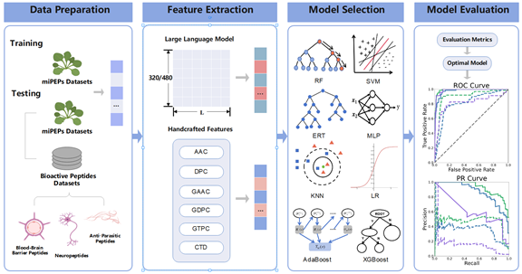

# pLM4PEP

plant miRNA encoded peptides prediction based on protein language model

## Introduction

Movitation:

Plant miPEPs play a crucial role in regulating diverse plant traits. Plant miPEPs identification is challenging due to limitations in the available number of known miPEPs for training. Meanwhile, existing prediction methods rely on manually encoded features to infer plant miPEPs. Recent advances in deep learning modeling of protein sequences provide an opportunity to improve the representation of key features, leveraging large datasets of protein sequences. In this study, we develop a prediction model based on ESM2 to achieve accurate identification of plant miPEPs.

Results:

We propose a prediction model, named pLM4PEP, to predict plant miPEPs. In this field, compared with state-of-the-artl predictor,  pLM4PEP enables more accurate prediction and stronger generalization ability. pLM4PEP utilizes ESM2 to extract peptide feature embeddings, with LR serving as the classifier. The validation experiments conducted on various biopeptide datasets show that pLM4PEP has superior prediction performance.



## Related Files

| FILE NAME               | DESCRIPTION                                                                                   |
|:----------------------- |:--------------------------------------------------------------------------------------------- |
| main.py                 | the main file of pLM4PEP predictor (include data reading, encoding, and classifier selection) |
| predictor.py            | Load pre trained model for prediction                                                         |
| requirements.py         | Python dependency packages that need to be installed                                          |
| ML_grid_search_model.py | Grid search method for optimizing the structure of neural network                             |
| datasets                | data                                                                                          |
| esm2                    | code for extracting the embedding layer                                                       |
| pydpi                   | protein calculation package                                                                   |
| feature.py              | protein characterization calculation library                                                  |
| model.joblib            | Saved trained pLM4PEP model                                                                   |

## Installation

- Requirement
  
  OS：
  
  - `Windows` ：Windows10 or later
  
  - `Linux`：Ubuntu 16.04 LTS or later

Python：

- `Python` >= 3.8
  
  - Download `pLM4PEP`to your computer
  
  ```bash
  git clone https://github.com/xialab-ahu/pLM4PEP.git
  ```

- open the dir in `conda prompt` and ceate a new environment named `myenv` with `requirements.txt`
  
  ```
  cd pLM4PEP
  conda env create -f requirements.txt -n myenv
  conda activate myenv
  ```


## Training and test pLM4PEP model
- Clone [ESM2](https://github.com/facebookresearch/esm) to the local "./pLM4PEP/esm reduced" directory

   Note: There are detailed tutorials available on this website(https://github.com/facebookresearch/esm)
- Extracting features using [ESM2](https://github.com/facebookresearch/esm)
```shell
cd "./pLM4PEP/esm-reduced"
python extract.py esm2_t12_35M_UR50D.pt esm2/train_dataset_500.txt esm2/train_dataset_500 --include mean
python extract.py esm2_t12_35M_UR50D.pt esm2/independent_test_dataset1_607.txt esm2/independent_test_dataset1_607 --include mean
python extract.py esm2_t12_35M_UR50D.pt esm2/independent_test_dataset2_612.txt esm2/independent_test_dataset2_612 --include mean
python extract.py esm2_t12_35M_UR50D.pt esm2/independent_test_dataset3_1018.txt esm2/independent_test_dataset3_1018 --include mean
```
- Run the `main. py` file to train and evaluate the pLM4PEP model
```shell
cd ..
python main.py
```

## Run pLM4PEP on a new test fasta file
```shell
python predictor.py --file test.fasta --out_path result
```

- `--file` : input the test file with fasta format

- `--out_path`: the output path of the predicted results


## Contact

Please feel free to contact us if you need any help.
